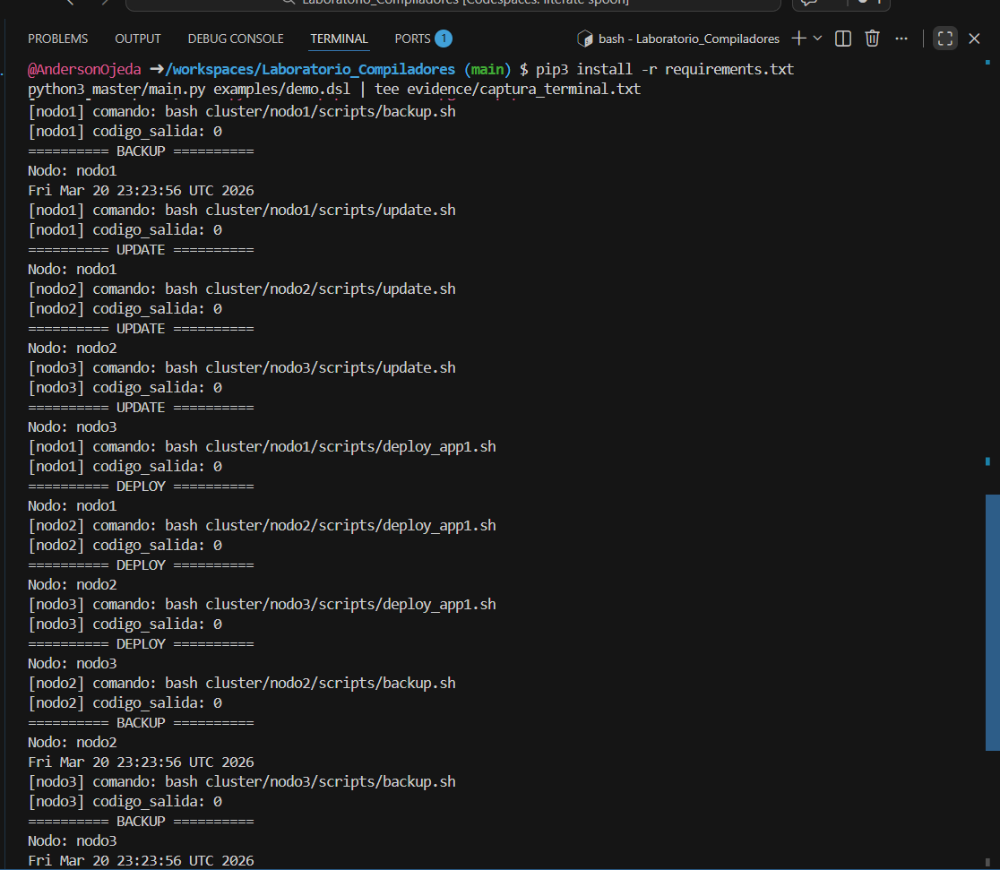
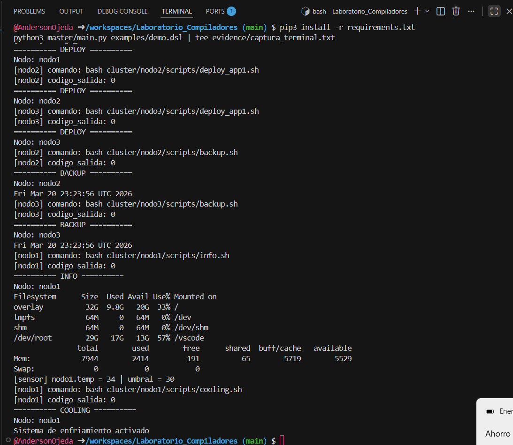

# Laboratorio Compiladores

Sistema de simulacion distribuida basado en un DSL, construido con una arquitectura tipo compilador:

`DSL -> Lexer -> Parser -> AST -> Interpreter -> Executor -> Shell -> Linux`

El proyecto permite:

- Interpretar instrucciones escritas en un lenguaje de dominio especifico.
- Ejecutar comandos en varios nodos simulados.
- Relacionar conceptos de compiladores con ejecucion real en Linux.

## Estructura

```text
project/
├── master/
│   ├── main.py
│   ├── config/
│   ├── executor/
│   └── interpreter/
├── cluster/
│   ├── nodo1/
│   │   ├── logs/
│   │   └── scripts/
│   ├── nodo2/
│   │   ├── logs/
│   │   └── scripts/
│   └── nodo3/
│       ├── logs/
│       └── scripts/
├── examples/
│   └── demo.dsl
└── requirements.txt
```

## Funcionalidades implementadas

- Ejecucion en nodo: `nodo1.run("backup.sh")`
- Ejecucion en grupo: `grupoA.update()`
- Deploy: `deploy app1 to grupoA`
- Bloque paralelo:

```dsl
parallel {
    nodo2.run("backup.sh");
    nodo3.run("backup.sh");
}
```

- Mejora adicional Opcion A: sensores simulados

```dsl
nodo1.temp > 30 -> nodo1.run("cooling.sh");
```

- Mejora adicional Opcion B: logs por nodo en `cluster/nodoX/logs/`
- Mejora adicional Opcion C y D: nuevo comando `nodo1.info()` con `df -h` y `free -m`

## DSL soportado

```dsl
nodo1.run("backup.sh");
grupoA.update();
deploy app1 to grupoA;

parallel {
    nodo2.run("backup.sh");
    nodo3.run("backup.sh");
}

nodo1.info();
nodo1.temp > 30 -> nodo1.run("cooling.sh");
```

## Instalacion

```bash
pip3 install -r requirements.txt
```

Si deseas regenerar el parser de ANTLR:

```bash
pip3 install antlr4-tools
antlr4 -Dlanguage=Python3 -visitor -o master/interpreter/generated master/interpreter/grammar/ClusterDSL.g4
mv master/interpreter/generated/master/interpreter/grammar/* master/interpreter/generated/
```

## Ejecucion

```bash
python3 master/main.py examples/demo.dsl
```

## Flujo del sistema

1. El archivo `.dsl` entra al sistema.
2. El lexer convierte texto en tokens.
3. El parser valida la gramatica y construye el arbol sintactico.
4. El AST builder transforma el arbol de ANTLR en nodos semanticos de Python.
5. El interpreter recorre esos nodos y decide que accion realizar.
6. El executor lanza el comando real en Linux con:

```python
cmd = f"bash cluster/{node}/scripts/{script}"
```

7. La shell ejecuta el script dentro del Codespace.

## Archivos principales

- [main.py](/workspaces/Laboratorio_Compiladores/master/main.py)
- [ClusterDSL.g4](/workspaces/Laboratorio_Compiladores/master/interpreter/grammar/ClusterDSL.g4)
- [parser_engine.py](/workspaces/Laboratorio_Compiladores/master/interpreter/parser_engine.py)
- [ast_builder.py](/workspaces/Laboratorio_Compiladores/master/interpreter/ast_builder.py)
- [interpreter.py](/workspaces/Laboratorio_Compiladores/master/interpreter/interpreter.py)
- [executor.py](/workspaces/Laboratorio_Compiladores/master/executor/executor.py)
- [cluster_config.py](/workspaces/Laboratorio_Compiladores/master/config/cluster_config.py)
- [demo.dsl](/workspaces/Laboratorio_Compiladores/examples/demo.dsl)

## Scripts por nodo

Cada nodo contiene:

- `backup.sh`
- `update.sh`
- `deploy_app1.sh`
- `info.sh`
- `cooling.sh`

## Pruebas obligatorias

El archivo [demo.dsl](/workspaces/Laboratorio_Compiladores/examples/demo.dsl) demuestra:

- ejecucion en un nodo
- ejecucion en grupo
- deploy a grupo
- ejecucion paralela
- salida clara por nodo
- condicion por sensor simulado

## Explicacion teorica obligatoria

### Que hace el lexer

El lexer toma el texto del DSL y lo divide en piezas pequenas llamadas tokens, por ejemplo: identificadores, parentesis, cadenas, palabras clave como `deploy` o `parallel`.

### Que hace el parser

El parser verifica que esos tokens respeten la gramatica del lenguaje. Si la sintaxis es correcta, construye un arbol sintactico.

### Que es el AST

El AST, o Abstract Syntax Tree, es una representacion estructurada del programa. En este proyecto se transforma el arbol de ANTLR en nodos como `NodeRun`, `Deploy`, `ParallelBlock` y `SensorRule`.

### Que hace el interpreter

El interpreter recorre el AST y decide la accion semantica correspondiente. Por ejemplo, si encuentra `deploy app1 to grupoA`, sabe que debe ejecutar `deploy_app1.sh` en todos los nodos de `grupoA`.

### Que hace el executor

El executor es la capa que conecta la interpretacion con la ejecucion real. Su trabajo es construir y lanzar comandos Bash locales dentro del repositorio.

### Donde ocurre la ejecucion real

La ejecucion real ocurre en Linux, dentro del Codespace, cuando Python invoca Bash para correr los scripts ubicados en `cluster/nodoX/scripts/`.

## Investigacion adicional implementada

Se implementaron varias mejoras para sumar valor al laboratorio:

- Sensores simulados con temperatura por nodo.
- Logs automáticos por nodo.
- Nuevo comando DSL `info()`.
- Script avanzado con `df -h` y `free -m`.

## Preguntas de reflexion

### Que diferencia hay entre simulacion y sistema distribuido real

La simulacion usa carpetas y procesos locales para imitar nodos. Un sistema distribuido real usa varias maquinas, red, sincronizacion real, latencias y fallos de hardware o conectividad.

### Que cambiaria para usar Raspberry Pi reales

Habria que reemplazar la ejecucion local por SSH o un agente remoto, configurar IPs reales, credenciales, seguridad, transferencia de archivos y monitoreo entre dispositivos fisicos.

### Por que usar un DSL en lugar de Python directamente

Porque un DSL reduce complejidad para el usuario final, limita las acciones a comandos validos del dominio y hace mas clara la relacion entre lenguaje, parser e interpretacion.

### Que ventajas tiene el paralelismo

Permite ejecutar tareas al mismo tiempo en varios nodos, reduce tiempo total de trabajo y se acerca mas al comportamiento esperado en automatizacion distribuida.

## Distribucion de roles sugerida

- Estudiante 1: gramatica ANTLR y definicion del DSL
- Estudiante 2: parser, AST e interpreter
- Estudiante 3: executor y paralelismo
- Estudiante 4: scripts Linux, pruebas y documentacion

## Resultado esperado

El proyecto demuestra comprension de:

- compiladores
- DSL
- Linux
- automatizacion
- sistemas distribuidos simulados

## Evidencia visual

<p align="center">
  
</p>
<p align="center"><em>Ejecucion principal del script DSL.</em></p>

<table align="center">
  <tr>
    <td align="center">
      <br/>
      <em>Salida clara por nodo y bloque paralelo.</em>
    </td>
    <td align="center">
      <br/>
      <em>Evidencia de logs por nodo.</em>
    </td>
  </tr>
</table>
